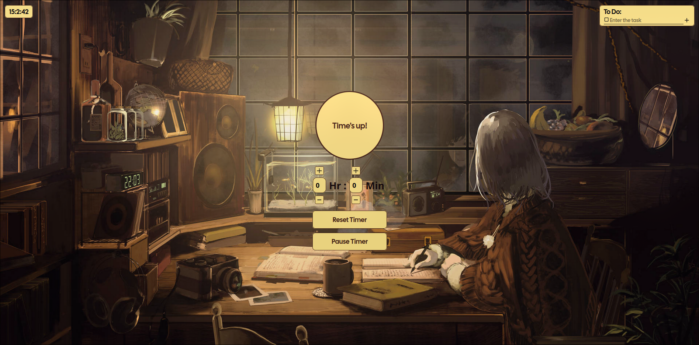

# ⏱️ Timer App Using React

A simple and responsive timer application built with React and Vite. This app displays the current time, updating every second, and serves as a foundational project to understand React hooks and component lifecycle.
🚀 Live Demo

Check out the live version here: [Live demo](https://timer-using-react-iota.vercel.app)
📸 Preview



### 🛠️ Features

    Real-time clock display with seconds

    Responsive design for various screen sizes

    Built using React functional components and hooks

    Fast development setup with Vite

### 🧰 Technologies Used

    React

    Vite

    JavaScript (ES6+)

    CSS

### 📦 Installation

Clone the repository:

```
git clone https://github.com/PragyanMaharjan63/timer-Using-React.git

cd timer-Using-React

npm install

```

Run the development server:

```
npm run dev
```

The app will be available at http://localhost:5173/ by default.

### 📁 Project Structure

<pre>
timer-Using-React/
├── public/
│ └── index.html
├── src/
│ ├── App.jsx
│ └── main.jsx
├── .gitignore
├── package.json
├── vite.config.js
└── README.md
</pre>

🧪 Usage

Upon launching the app, you'll see the current time displayed in hours, minutes, and seconds. The time updates every second, providing a real-time clock experience.
